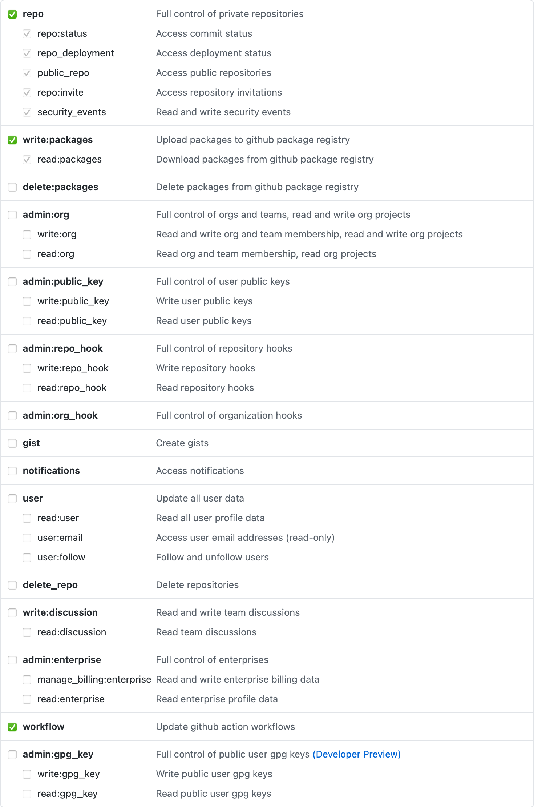

# Pipeline Builder
The Pipeline Builder is a collection of tools related to GitHub Actions and other GitHub-related concerns for Paketo-style buildpacks.  This collection includes GitHub actions, a CLI that configures pipelines for repositories, and a collection of descriptors for existing repositories.

- [Pipeline Builder](#pipeline-builder)
  - [Octo Pipelines](#octo-pipelines)
    - [Getting Started](#getting-started)
    - [Common Workflows](#common-workflows)
      - [Dependendabot](#dependendabot)
      - [Labels](#labels)
      - [Pipeline Updater](#pipeline-updater)
      - [Release Drafter](#release-drafter)
    - [Descriptor](#descriptor)
      - [`github` (REQUIRED)](#github-required)
      - [`codeowners`](#codeowners)
      - [`package`](#package)
      - [`builder`](#builder)
      - [`docker_credentials`](#docker_credentials)
      - [`http_credentials`](#http_credentials)
      - [`dependencies`](#dependencies)
      - [`test`](#test)
      - [`path`](#path)
      - [`offline_packages`](#offline_packages)
      - [`republish_images`](#republish_images)
      - [`actions`](#actions)
  - [Actions](#actions-1)
    - [Adoptium Dependency](#adoptium-dependency)
    - [Alibaba Dragonwell Dependency](#alibaba-dragonwell-dependency)
    - [Amazon Corretto Dependency](#amazon-corretto-dependency)
    - [AppDynamics Dependency](#appdynamics-dependency)
    - [Aqua Security Dependency](#aqua-security-dependency)
    - [Azul Zulu Dependency](#azul-zulu-dependency)
    - [Bellsoft Liberica Dependency](#bellsoft-liberica-dependency)
    - [CA APM Dependency](#ca-apm-dependency)
    - [CF Java Index Dependency](#cf-java-index-dependency)
    - [Clojure Tools Dependency](#clojure-tools-dependency)
    - [Foojay Dependency](#foojay-dependency)
    - [GCS Dependency](#gcs-dependency)
    - [GitHub Release Dependency](#github-release-dependency)
    - [Google Stackdriver Profiler Dependency](#google-stackdriver-profiler-dependency)
    - [GraalVM Dependency](#graalvm-dependency)
    - [Gradle Dependency](#gradle-dependency)
    - [IBM Semeru Dependency](#ibm-semeru-dependency)
    - [JProfiler Dependency](#jprofiler-dependency)
    - [JRebel Dependency](#jrebel-dependency)
    - [Leiningen Dependency](#leiningen-dependency)
    - [Maven Dependency](#maven-dependency)
    - [New Relic Dependency](#new-relic-dependency)
    - [NPM Dependency](#npm-dependency)
    - [OverOps Dependency](#overops-dependency)
    - [Paketo Deps Dependency](#paketo-deps-dependency)
    - [Riverbed Dependency](#riverbed-dependency)
    - [Rustup Init Dependency](#rustup-init-dependency)
    - [Skywalking Dependency](#skywalking-dependency)
    - [Spring Generations](#spring-generations)
    - [Tomcat Dependency](#tomcat-dependency)
    - [Tomee Dependency](#tomee-dependency)
    - [YourKit Dependency](#yourkit-dependency)
  - [License](#license)

## Octo Pipelines
Octo Pipelines is a CLI that generates a collection of GitHub Workflows and other Github-related artifacts in a repository.  The pipeline generator takes a simplified descriptor as input and transforms it into more complicated workflows and artifacts.

### Getting Started
The command line can either be built or run directly using Go.

```shell
$: go run github.com/paketo-buildpacks/pipeline-builder/cmd/octo --descriptor <DESCRIPTOR>
```

The input is a YAML-based descriptor, examples of which can be found in `.github/pipeline-descriptor.yml` in other repositories.

### Common Workflows
Regardless of the contents of the descriptor the pipeline builder creates a minimal set of workflows and artifacts.

#### Dependendabot
* [Example `dependabot.yml`](https://github.com/paketo-buildpacks/adoptium/blob/main/.github/dependabot.yml)

A [Dependendabot configuration file](https://docs.github.com/en/free-pro-team@latest/github/administering-a-repository/enabling-and-disabling-version-updates) is added to all repositories.  It will always add an update for `github-actions`, and if the repository contains a `go.mod` file, it will also add an update for `gomod`.

#### Labels
* [Example Labels](https://github.com/paketo-buildpacks/adoptium/labels)
* [Example `labels.yml`](https://github.com/paketo-buildpacks/adoptium/blob/main/.github/labels.yml)
* [Example `synchronize-labels.yml`](https://github.com/paketo-buildpacks/adoptium/blob/main/.github/workflows/synchronize-labels.yml)
* [Example `minimal-labels.yml`](https://github.com/paketo-buildpacks/adoptium/blob/main/.github/workflows/minimal-labels.yml)

In order to facilitate the automated creation of draft releases and notes, a set of semver-scope labels (`semver:major`, `semver:minor`, and `semver:patch`) and type labels (`type:bug`, `type:dependency-upgrade`, `type:documentation`, `type:enhancement`, `type:question`, `type:task`) are added to the repository.  In addition, a workflow that enforces exactly one of each label is attached to every PR.

#### Pipeline Updater
* [Example `update-pipeline.yml`](https://github.com/paketo-buildpacks/adoptium/blob/main/.github/workflows/update-pipeline.yml)

A pipeline-updating workflow is added to the repository to ensure that workflows are kept up to date as the `pipeline-builder` evolves.

#### Release Drafter
* [Example Release Notes](https://github.com/paketo-buildpacks/adoptium/releases/tag/v4.1.0)
* [Example `release-drafter.yml`](https://github.com/paketo-buildpacks/adoptium/blob/main/.github/release-drafter.yml)
* [Example `update-draft-release.yml`](https://github.com/paketo-buildpacks/adoptium/blob/main/.github/workflows/update-draft-release.yml)

Draft release notes are created on every commit to `main`.  These notes take into account every PR since the previous release in order to create a division of the types of changes that were made and the semver scope of the change to work out the next release number.

### Descriptor
The descriptor is a YAML document with a number of top-level keys that correspond to new workflows, modified workflows, or artifacts.  All top-level keys except `github` are optional.

#### `github` (REQUIRED)
```yaml
github:
  username: ${{ secrets.JAVA_GITHUB_USERNAME }}
  token:    ${{ secrets.JAVA_GITHUB_TOKEN }}
```
`github` is an object the describes the GitHub identity that the pipeline should use in the many places that GitHub API access is required.  The token must be granted the `repo`, `write:packages`, and `workflow` scopes.



#### `codeowners`
```yaml
codeowners:
- path:  "*"
  owner: "@paketo-buildpacks/java-buildpacks"
```

* [Example `CODEOWNERS`](https://github.com/paketo-buildpacks/adoptium/blob/main/.github/CODEOWNERS)

`codeowners` is a list of objects test describe a `path` and `owner`.  Each of these objects corresponds to a line in [`CODEOWNERS`](https://docs.github.com/en/free-pro-team@latest/github/creating-cloning-and-archiving-repositories/about-code-owners) file.

#### `package`
```yaml
package:
  repository:           gcr.io/paketo-buildpacks/adoptium
  include_dependencies: false
  register:             true
  registry_token:       ${{ secrets.JAVA_REGISTRY_TOKEN }}
  platform:
    os: linux
```

* [Example `create-package.yml`](https://github.com/paketo-buildpacks/adoptium/blob/main/.github/workflows/create-package.yml)
* [Example `test.yml`](https://github.com/paketo-buildpacks/adoptium/blob/main/.github/workflows/tests.yml)

`package` is an object that describes the `repository` a buildpackage should be published to as well as whether to include the buildpackage's dependencies when creating it (`false` by default).  If defined, a `create-package` workflow is created that creates and publishes a new package when a release is published as well as adds a `create-package` job to the tests workflow that is run on each PR and each commit.  It will also add additional content to the draft release notes about the contents of the build package and will update the digest of the buildpackage in the published release notes.  If `register` is `true`, after the package is created, it is registered with the [Buildpack Registry Index](https://github.com/buildpacks/registry-index).

`platform` describes what platform the created package should be built for. `os` can be set to `linux` or `windows` (`linux` by default).

#### `builder`
```yaml
builder:
  repository: gcr.io/projectriff/builder
```

* [Example `create-builder.yml`](https://github.com/projectriff/builder/blob/main/.github/workflows/create-builder.yml)
* [Example `test.yml`](https://github.com/projectriff/builder/blob/main/.github/workflows/tests.yml)

`builder` is an object that describes the `repository` a builder should be published to.  If defined, a `create-builder` workflow is created that's creates and publishes a new builder when a release is published as well as adds a `create-builder` job to the tests workflow that is run on each PR and each commit.  It will also add additional content to the draft release notes about the contents of the build package and will update the digest of the builder in the published release notes.  Finally it will add update workflows for the lifecycle and builder image elements of the `builder.toml` file.

#### `docker_credentials`
```yaml
docker_credentials:
- registry: gcr.io
  username: _json_key
  password: ${{ secrets.JAVA_GCLOUD_SERVICE_ACCOUNT_KEY }}
```

`docker_credentials` is a list of objects that describes a `registry`, `username`, and `password` for authenticating against a Docker registry.  In every job that registry access is required, a [Docker Login Action](https://github.com/marketplace/actions/docker-login) is created and conditionalized so that it will only run on pushes to `main` and on PRs that come from the same repository (to protect the secrets).

#### `http_credentials`
```yaml
http_credentials:
- host:     download.aquasec.com
  username: ${{ secrets.AQUA_SECURITY_USERNAME }}
  password: ${{ secrets.AQUA_SECURITY_PASSWORD }}
```

`http_credentials` is a list of objects that describe a `host`, `username`, and `password` for authenticating requests against an HTTP endpoint.  In every job that HTTP access is required a [`.netrc` file](https://www.gnu.org/software/inetutils/manual/html_node/The-_002enetrc-file.html) is written and conditionalized so that it will only be written on pushes to `main` and on PRs that come from the same repository (to protect the secrets).

#### `dependencies`
```yaml
dependencies:
- name:            JRE 11
  id:              jre
  version_pattern: "11\\.[\\d]+\\.[\\d]+"
  purl_pattern:    "version-11\\.[\\d]+\\.[\\d]+"
  cpe_pattern:     "patch[\\d]+"
  uses:            docker://ghcr.io/paketo-buildpacks/actions/adoptium-dependency:main
  with:
    implementation: hotspot
    type:           jre
    version:        "[11,12)"
```

* [Example `update-*.yml`](https://github.com/paketo-buildpacks/adoptium/blob/main/.github/workflows/update-jre-11.yml)

`dependencies` is a list of objects that define how dependencies are detected and updated by describing an optional `name` (defaults to `id`), `id` that matches a `buildpack.toml` defined dependency id, an optional `version_pattern` that defines which dependency with a given `id` to update, optional `purl_pattern` and `cpe_pattern` values which allow you to provide alternative patterns for updating the CPEs and PURL (they default to the version pattern), a `uses` to define which GitHub Action to use to find the next version, and a `with` used to configure the GitHub action to use to find the next version.  If defined, each object will create an `update` workflow that is responsible for detecting a new version, updating `buildpack.toml` and opening a PR to include the change in the repository, if appropriate.

#### `test`
```yaml
test:
  steps:
  - name: Install richgo
    run: |
      #!/usr/bin/env bash

      set -euo pipefail

      GO111MODULE=on go get -u -ldflags="-s -w" github.com/kyoh86/richgo
  - name: Run Tests
    run: |
      #!/usr/bin/env bash

      set -euo pipefail

      richgo test ./...
    env:
      RICHGO_FORCE_COLOR: "1"
```

`test` is an object that allows you to override the default test configuration by specifying a list of `steps` as defined by the [GitHub Actions reference documentation][gha].  The default value is described in the example above.

[gha]: https://docs.github.com/en/free-pro-team@latest/actions/reference/workflow-syntax-for-github-actions#jobsjob_idsteps

#### `path`
```yaml
path: ..
```

`path` is a pointer to a Git repository, on your local filesystem, where files will be created.  If unspecified, the default is `..`.

#### `offline_packages`
```yaml
offline_packages:
- source: paketo-buildpacks/adoptium
  target: gcr.io/tanzu-buildpacks/adoptium
  tag_prefix: my-buildpack/
  source_path: subdir/adoptium
  platform:
    os: linux
```

`offline_packages` is a list of objects that describe a `source` GitHub repository and a `target` Docker registry location.  If defined, each object will create a `create-package` workflow that is responsible for detecting a new online buildpackage release and creating a matching offline buildpackage release and publishing it.

`source_path` is the optional path to the buildpack's directory relative to the repository's root. Defaults to the repository root.

`tag_prefix` is the optional prefix to filter for when detecting the buildpack's version via tags. Defaults to empty string.

`platform` describes what platform the created package should be built for. `os` can be set to `linux` or `windows` (`linux` by default).

#### `republish_images`
```yaml
republish_images:
- source: gcr.io/paketo-buildpacks/bellsoft-liberica
  target: gcr.io/tanzu-buildpacks/bellsoft-liberica-lite
  id: tanzu-buildpacks/bellsoft-liberica-lite
  target_repo: paketo-buildpacks/bellsoft-liberica
  tag_prefix: java/
```

`republish_images` is a list of objects that describe a `source` Docker registry location, a `target` Docker registry location, and a new buildpack id. If defined, each object will create a `republish-image` workflow that is responsible for detecting new source images, modifying the buildpack id of the image to the new id, and publishing a new target image with the modified buildpack id.

The `target_repo` setting can be used to point the workflow to a different source control repository for the target image. It's assumed to be the current repository, but for cases where you have a utility repo which is republishing multiple images you need to point the workflow to are repository from which it can read the git tags and extract the target version. The example above, points it to the source image's code repository so it'll end up with a source and target version that are in sync.

`tag_prefix` is the optional prefix to filter for when detecting the buildpack's version via tags. Defaults to empty string.

#### `actions`
```yaml
actions:
- source: adoptium-dependency
  target: ghcr.io/paketo-buildpacks/actions/adoptium-dependency
```

* [Example `create-action-*.yml`](https://github.com/paketo-buildpacks/pipeline-builder/blob/main/.github/workflows/create-action-adoptium-dependency.yml)

`actions` is a list of objects that describe a `source` directory within this repository's `actions/` directory, and a `target` Docker registry location.  If defined, each object will create a `create-action` workflow that is responsible for building and publishing new versions of the action.

## Actions
This repository contains the source code and build pipelines for a collection of GitHub actions that are used by buildpacks.  Most of these actions are used to find the latest version of given dependencies.

All the of the dependency actions also accept a `pre_release` configuration option (`true` by default) of whether to return pre-release versions.

### Adoptium Dependency
The Adoptium Dependency queries the [Adoptium API](https://api.adoptium.net/swagger-ui/) for new versions.

```yaml
uses: docker://ghcr.io/paketo-buildpacks/actions/adoptium-dependency:main
with:
  implementation: hotspot
  type:           jre
  version:        "[11,12)"
```

### Alibaba Dragonwell Dependency
The Alibaba Dependency watches [Alibaba repositories](https://github.com/alibaba/) for new versions.

```yaml
uses: docker://ghcr.io/paketo-buildpacks/actions/alibaba-dragonwell-dependency:main
with:
  glob:       Alibaba_Dragonwell_[\d\.]+_x64_linux.tar.gz$
  repository: dragonwell<jdk-version>
  token:      ${{ secrets.JAVA_GITHUB_TOKEN }}
```

### Amazon Corretto Dependency
The Amazon Corretto Dependency watches [Amazon Corretto repositories](https://github.com/corretto/) for new versions.

```yaml
uses: docker://ghcr.io/paketo-buildpacks/actions/amazon-corretto-dependency:main
with:
  glob:       amazon-corretto-11\.[\d.-]+-linux-x64.tar.gz
  repository: corretto-11
```

### AppDynamics Dependency
The AppDynamics Dependency queries the [AppDynamics API](https://download.appdynamics.com/download/downloadfilelatest/) for new versions.

```yaml
uses: docker://ghcr.io/paketo-buildpacks/actions/appdynamics-dependency:main
with:
  type: sun-jvm
```

### Aqua Security Dependency
The Aqua Security Dependency queries the [Aqua Security API](https://get.aquasec.com/scanner-releases.txt) for new versions.

```yaml
uses: docker://ghcr.io/paketo-buildpacks/actions/aqua-security-dependency:main
with:
  username: ${{ secrets.AQUA_SECURITY_USERNAME }}
  password: ${{ secrets.AQUA_SECURITY_PASSWORD }}
```

### Azul Zulu Dependency
The Azul Zulu Dependency queries the [Azul Zulu API](https://app.swaggerhub.com/apis-docs/azul/zulu-download-community/1.0) for new versions.

```yaml
uses: docker://ghcr.io/paketo-buildpacks/actions/azul-zulu-dependency:main
with:
  type:    headfull
  version: "11"
```

### Bellsoft Liberica Dependency
The Bellsoft Liberica Dependency queries the [Bellsoft Liberica API](https://api.bell-sw.com/api.html) for new versions.

```yaml
uses: docker://ghcr.io/paketo-buildpacks/actions/bellsoft-liberica-dependency:main
with:
  type:    jre
  version: "11"
```

### CA APM Dependency
The CA APM Dependency watches the [CA APM Download Page](https://ca.bintray.com/apm-agents) for new versions.

```yaml
uses: docker://ghcr.io/paketo-buildpacks/actions/ca-apm-dependency:main
with:
  type: java
```

### CF Java Index Dependency
The CF Java Index Dependency querys a CloudFoundry Java buildpack v2 `index.yml` file for new versions.

```yaml
uses: docker://ghcr.io/paketo-buildpacks/actions/cf-java-index-dependency:main
with:
  repository_root: <repo-root>
```

### Clojure Tools Dependency
The Clojure Tools Dependency watches [Clojure Tools repositories](https://github.com/clojure/clojure-tools) for new versions. It then filters based on the [stable.properties](https://raw.githubusercontent.com/clojure/brew-install/%s/stable.properties) file in their brew tap repo, allowing it to pick the most recent stable version.

```yaml
uses: docker://ghcr.io/paketo-buildpacks/actions/clojure-tools-dependency:main
with:
  token:      ${{ secrets.JAVA_GITHUB_TOKEN }}
```

### Foojay Dependency
The Foojay Dependency queries the [Foojay API](https://api.foojay.io/swagger-ui#/) for new versions.

```yaml
uses: docker://ghcr.io/paketo-buildpacks/actions/foojay-dependency:main
with:
  distro:  microsoft
  type:    jdk
  version: "11"
```

### GCS Dependency
The GCS Dependency watches [GCS Buckets](https://cloud.google.com/storage) for new versions.  The first capture in `glob` is used as the version.

```yaml
uses: docker://ghcr.io/paketo-buildpacks/actions/gcs-dependency:main
with:
  bucket: projectriff
  glob:   command-function-invoker/command-function-invoker-linux-amd64-([\d\.]+).tgz
```

### GitHub Release Dependency
The GitHub Release Dependency watches GitHub Releases for new versions.  The first capture in `glob` is used as the version.

```yaml
uses: docker://ghcr.io/paketo-buildpacks/actions/github-release-dependency:main
with:
  glob:       sapmachine-jre-.+_linux-x64_bin.tar.gz
  owner:      SAP
  repository: SapMachine
  tag_filter: sapmachine-(11.*)
  token:      ${{ secrets.GITHUB_TOKEN }}
```

### Google Stackdriver Profiler Dependency
The Google Stackdriver Profiler Dependency watches the [Google Cloud Profiler bucket](https://storage.googleapis.com/cloud-profiler) for new versions.

```yaml
uses: docker://ghcr.io/paketo-buildpacks/actions/google-stackdriver-profiler-dependency:main
```

### GraalVM Dependency
The GraalVM Dependency watches the [GraalVM Repository](https://github.com/graalvm/graalvm-ce-builds) for new versions.

```yaml
uses: docker://ghcr.io/paketo-buildpacks/actions/graalvm-dependency:main
with:
  glob:    graalvm-ce-java11-linux-amd64-.+.tar.gz
  token:   ${{ secrets.GITHUB_TOKEN }}
  version: 11
```

### Gradle Dependency
The Gradle Dependency queries the [Gradle API](https://raw.githubusercontent.com/gradle/gradle/master/released-versions.json) for new versions.

```yaml
uses: docker://ghcr.io/paketo-buildpacks/actions/gradle-dependency:main
```

### IBM Semeru Dependency
The IBM Semeru Dependency queries the [Gradle API](https://raw.githubusercontent.com/gradle/gradle/master/released-versions.json) for new versions.

```yaml
uses: docker://ghcr.io/paketo-buildpacks/actions/ibm-semeru-dependency:main
with:
  glob: ibm-semeru-open-jdk_x64_linux_.+_openj9-.+.tar.gz
  owner: ibmruntimes
  repository: semeru8-binaries
  tag_filter: jdk(.*8.*)
  token: ${{ secrets.JAVA_GITHUB_TOKEN }}
```

### JProfiler Dependency
The JProfiler Dependency watches the [JProfiler Changelog](https://www.ej-technologies.com/download/jprofiler/changelog.html) for new versions.

```yaml
uses: docker://ghcr.io/paketo-buildpacks/actions/jprofiler-dependency:main
```

### JRebel Dependency
The JRebel Dependency watches the [JRebel Download Page](https://www.jrebel.com/products/jrebel/download/prev-releases) for new versions.

```yaml
uses: docker://ghcr.io/paketo-buildpacks/actions/jrebel-dependency:main
```

### Leiningen Dependency
The Leiningen Dependency watches the [Leiningen Repository](https://github.com/technomancy/leiningen) for new versions.

```yaml
uses: docker://ghcr.io/paketo-buildpacks/actions/leiningen-dependency:main
with:
  token: ${{ secrets.GITHUB_TOKEN }}
```

### Maven Dependency
The Maven Dependency queries a [Maven Repository](https://repo1.maven.org/maven2) for new versions.

```yaml
uses: docker://ghcr.io/paketo-buildpacks/actions/maven-dependency:main
with:
  uri:         https://repo1.maven.org/maven2
  group_id:    org.apache.maven
  artifact_id: apache-maven
  classifier:  bin
  packaging:   tar.gz
```

### New Relic Dependency
The New Relic Dependency watches the [New Relic Download Page](https://download.newrelic.com/php_agent/archive/index.html) for new versions.

```yaml
uses: docker://ghcr.io/paketo-buildpacks/actions/new-relic-dependency:main
with:
  type: php
```

### NPM Dependency
The NPM Dependency queries the [NPM API](https://registry.npmjs.org) for new versions.

```yaml
uses: docker://ghcr.io/paketo-buildpacks/actions/npm-dependency:main
with:
  package: "@google-cloud/debug-agent"
```

### OverOps Dependency
The OverOps Dependency watches the [OverOps Download Page](https://app.overops.com/app/download?t=sa-tgz) for new versions.

```yaml
uses: docker://ghcr.io/paketo-buildpacks/actions/overops-dependency:main
```

### Paketo Deps Dependency
The Paketo Deps Dependency queries the [Paketo Deps Server](https://api.deps.paketo.io/v1/dependency?name) for new versions.

```yaml
uses: docker://ghcr.io/paketo-buildpacks/actions/paketo-deps-dependency:main
with:
  name: rust
```

### Riverbed Dependency
The Riverbed Dependency watches the [Riverbed Bucket](http://s3.amazonaws.com/appint-pcf-instrumentation-rpm-master) for new versions.

```yaml
uses: docker://ghcr.io/paketo-buildpacks/actions/riverbed-dependency:main
```

### Rustup Init Dependency
The Rustup Init Dependency queries the [Rustup Github Project](https://github.com/rust-lang/rustup) for new versions. The `target` specifies the target triple to download.

```yaml
uses: docker://ghcr.io/paketo-buildpacks/actions/rustup-init-dependency:main
with:
  target: x86_64-unknown-linux-musl
  token: ${{ secrets.PAKETO_BOT_GITHUB_TOKEN }}
```

### Skywalking Dependency
The Skywalking Dependency watches the [Apache Skywalking Download Page](https://archive.apache.org/dist/skywalking) for new versions.

```yaml
uses: docker://ghcr.io/paketo-buildpacks/actions/skywalking-dependency:main
```

### Spring Generations
The Spring Generations queries the [Spring Generations API](https://spring.io/restdocs/index.html#generation) for the generation lifecycle of Spring projects.

```yaml
uses: docker://ghcr.io/paketo-buildpacks/actions/spring-generations:main
with:
  uri: https://spring.io/api
```

### Tomcat Dependency
The Tomcat Dependency watches the [Apache Tomcat Download Page](https://archive.apache.org/dist/tomcat/tomcat-9/) for new versions.

```yaml
uses: docker://ghcr.io/paketo-buildpacks/actions/tomcat-dependency:main
with:
  uri: https://archive.apache.org/dist/tomcat/tomcat-9
```

### Tomee Dependency
The Tomee Dependency watches the [Apache Tomee Download Page](https://archive.apache.org/dist/tomee/) for new versions. Available distributions are `microprofile`, `webprofile`, `plus` or `plume`

```yaml
uses: docker://ghcr.io/paketo-buildpacks/actions/tomee-dependency:main
with:
  uri: https://archive.apache.org/dist/tomee/
  dist: webprofile
```  

### YourKit Dependency
The YourKit Dependency watches the [YourKit Download Page](https://www.yourkit.com/java/profiler/download) for new versions.

```yaml
uses: docker://ghcr.io/paketo-buildpacks/actions/yourkit-dependency:main
```

## License
This library is released under version 2.0 of the [Apache License][a].

[a]: https://www.apache.org/licenses/LICENSE-2.0
